# Conceitos

## O que é um agente inteligente?
Um agente inteligente é um agente racional que age consegue perceber o ambiente e agir sobre esse ambiente.

## O que é aprendizado de máquina (Machine Learning ML)?
O computador performa sem a necessidade de intruções do programador. Ele aprende através de dados informados a ele. Esses dados são rotulados (label) com as respostas corretas que o ML deve ter, dessa forma, ele consegue feedback das respostas certas e erradas para se adaptar ao problema.

- Machine Learning faz parte da área de inteligência artificial.

## Como funciona o processo de Machine Learning ?
1. É entregue para a IA uma sequência de entradas rotuladas com suas respectivas respostas baseada em um problema. Nada além disso é alimentada para IA que deve descobrir as regras sozinhas.
2. Se entrega uma nova entrada não rotulada, e espera que a IA consiga responder corretamente. Isso é chamado de inferência.

## Paradigmas de Machine Learning ?

- Supervisioned learning: A IA recebe exemplos rotulados com as respostas para aquela entrada e descobre por si mesmo as regras.
- Unsupervisioned learning: A IA recebe exemplos de estruturas com objectos com características distintas, mas não rotuladas, e espera-se que a IA consiga criar regras para diferenciá-los.
- Reinforcement learning: Coloca-se a IA em um ambiente virtual em que ela recebe recompensas se atingir os objetivos definidos.

## O que é Neural Network?
Neural network é um algoritmo de machine learning. Eles são estruturados em layers (camadas) tendo os layer:
- input layer
- hidden layers
- output layer

## O que é Deep Learning (DL)?
É simplesmente um modelo de Machine Learning (ML) que utiliza o algoritmo neural network de forma profunda, com vários hidden layers. Diferente de outros algoritmos de ML, o uso de DL é mais end-to-end, no sentido de que os dados não são pré-processados antes de serem enviadas para a IA, dessa forma, usando DL é necessário maiores quantidades de dados, mais poder computacional, mas é extensivamente melhor para problemas mais complexos.

## O que é uma Epoch?
É a quantidade de vezes que se alimenta todos os dados de treinamento para a IA.

## Como funcionam os neurônios em Deep Learning (DL)?
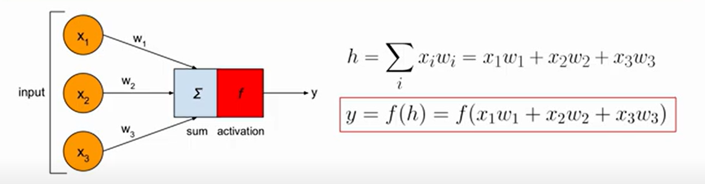
O somátorio pode ser chamado de net input.
Um neurónio transforma um input em um output através de uma função de ativação.

## Função de ativação sigmoid
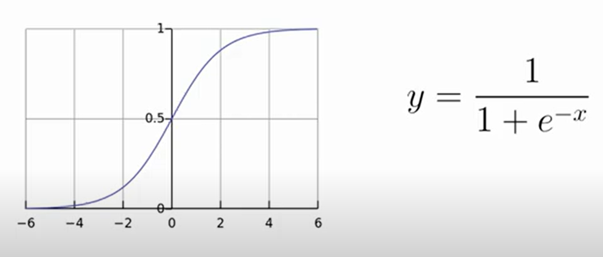
x = (x1*w1 + x2*w2 + x3*w3)
x é o resultado do somatório

## Matriz operations
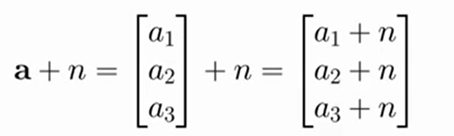
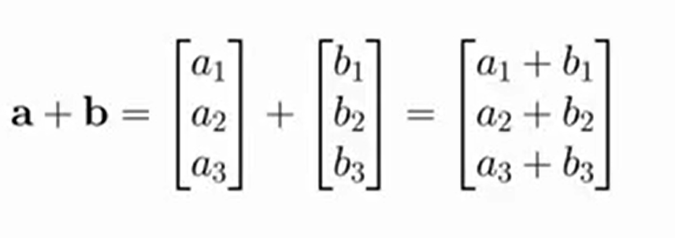
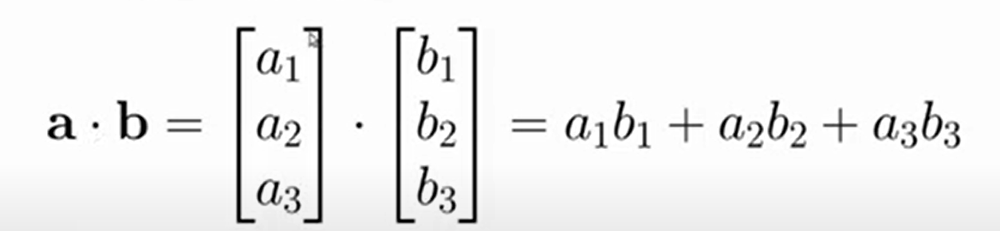
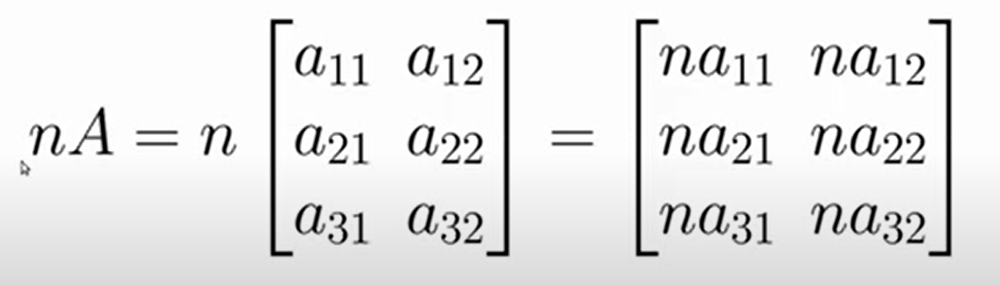
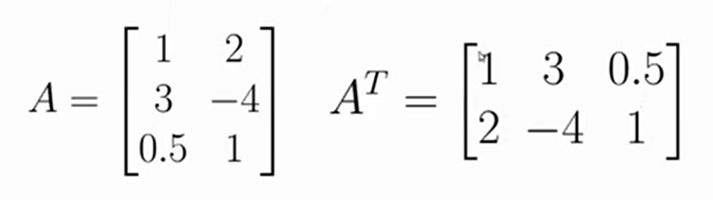
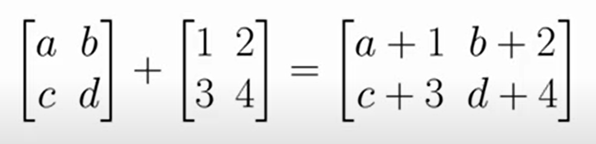
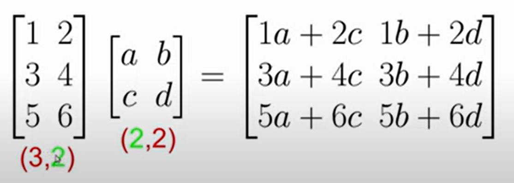

## Computação em Multi Layer Perception (MLP)
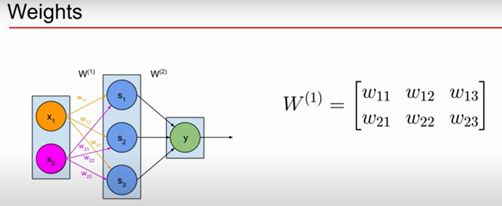

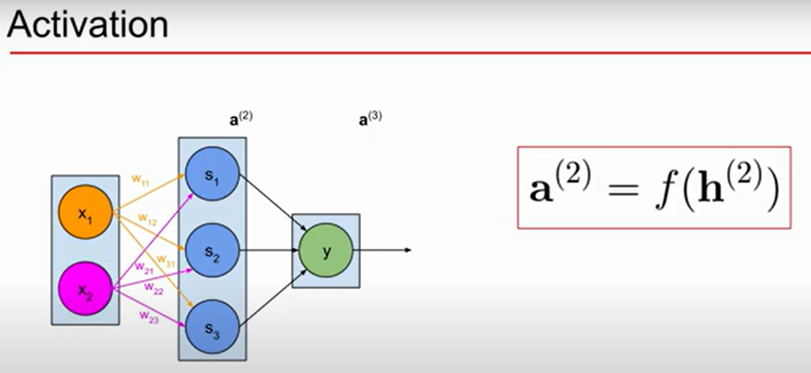

## Theory behind trainig a neural network
Input signal (forward propagation) em que se processa:
- Get prediction: (Net input and activation function)
- Calculate the error (E = Error(prediction, expected_outcome), like activation functions that are various ways of calculating the error, one of which is the quadratic formula: 1/2*(p - ex)**2)
Error signal (backwark propagation) em que se processa:
- Calculate gradient of error function over the weigths (caculate derivatives)
- Update parameters (Gradient descent)

## Caculate gradient of error function over the weigths (calculus):
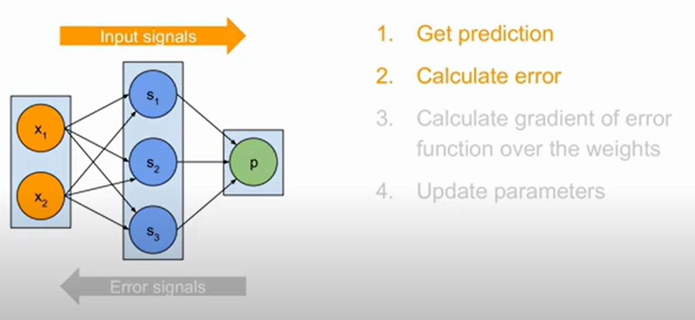
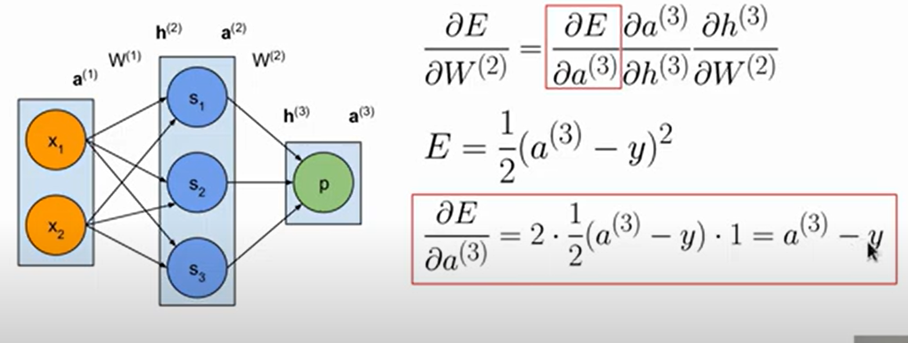
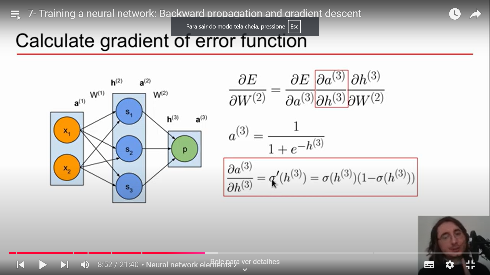
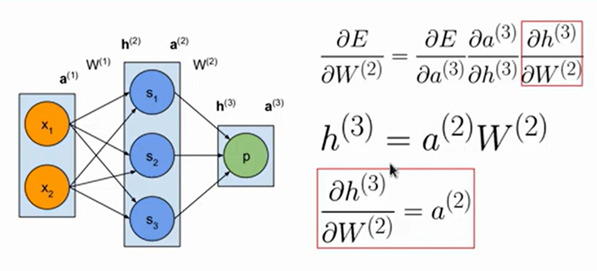
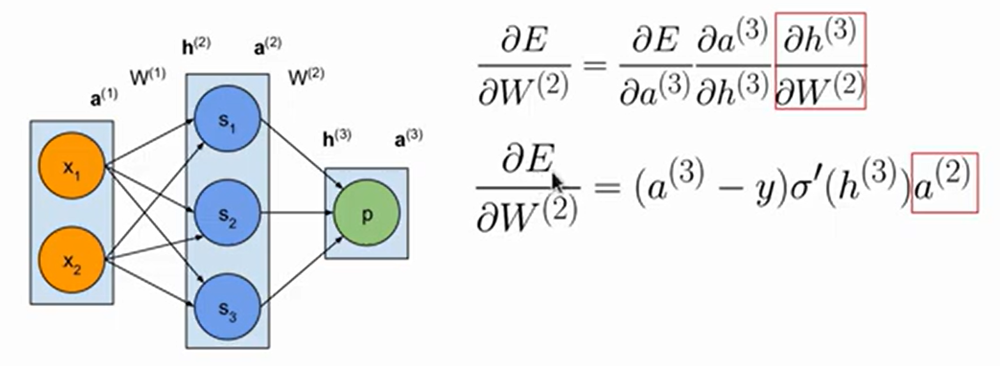
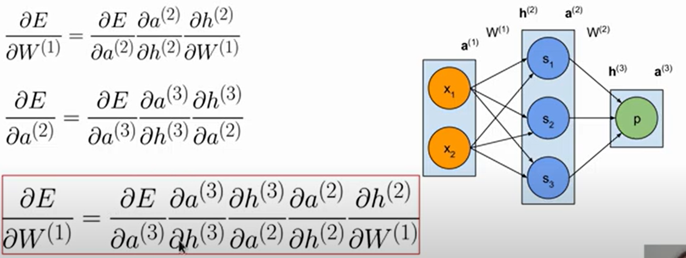
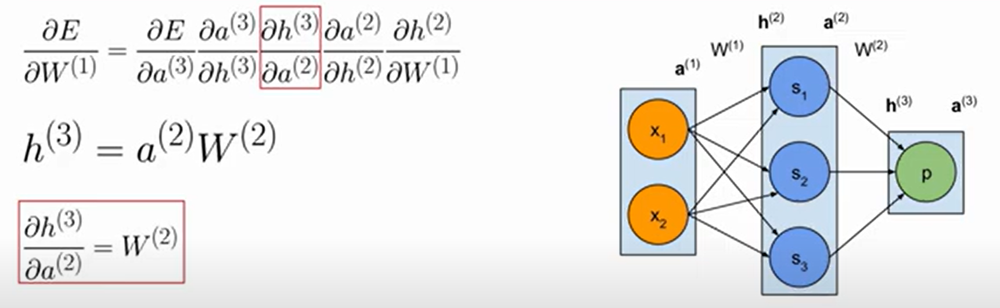
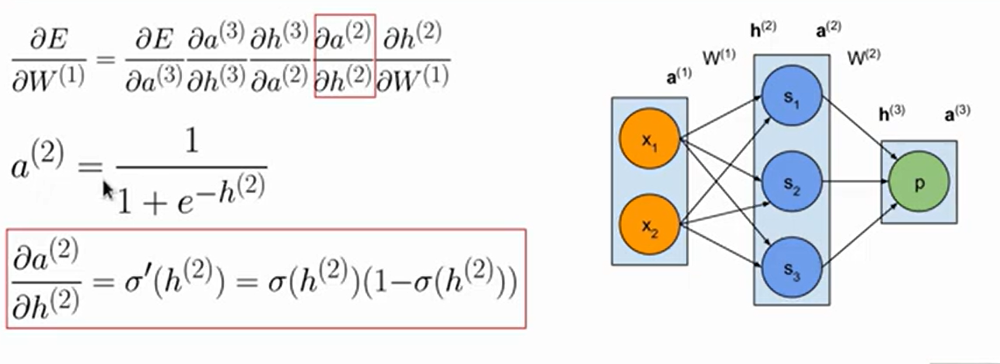
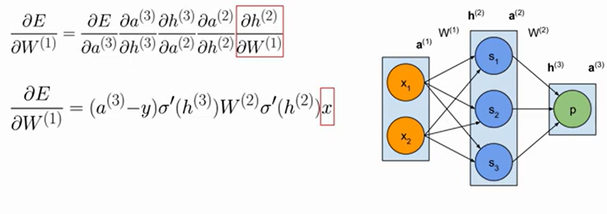
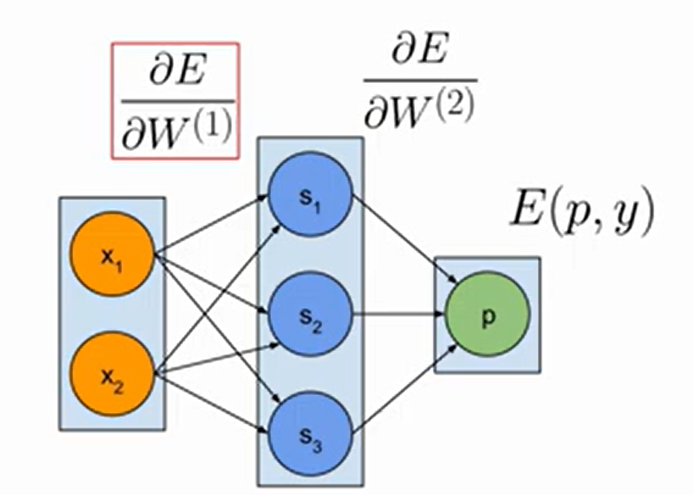

## Gradient descent

# Audio preprocessing para IA

##