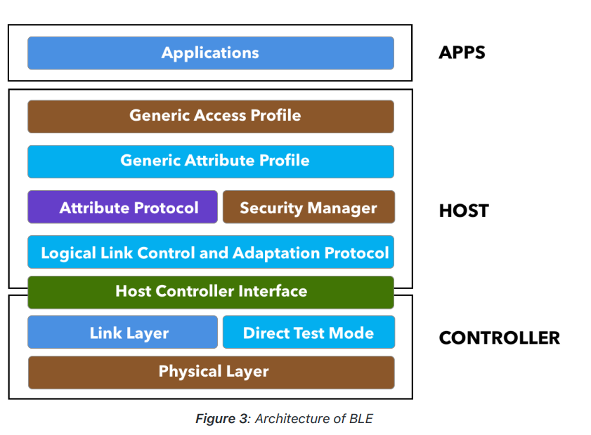

# Bluetooth Concepts

## Bluetooth Low Energy (BLE) concepts:
### BLE Architecture

- Application: the part where the handling of data and implementation of the BLE happens, is where the programmers will code the logic of the data.
- Physical Layer: is the radio hardware used for communication.
- Link Layer: Abstraction between the Physical and the rest of the BLE architecture
- HCI: Protocol for internal communication between the host and controller

### BLE device states:
- Advertising state: Send packages advertising connection
- Scanning state: Scan for advertising devices
- Connected state: The devices have stablished a link. The one who initiates the connection is the Master and the one who was advertising is now slave.

### Peripheral, Central, Broadcaster e Observer:
- Peripherals: Advertise and connect to central devices, they become the slaves.
- Centrals: Discover advertising devices and connects, they become the masters.
- Broadcaster: Only advertise its existence.
- Observer: Only discover advertising devices.

