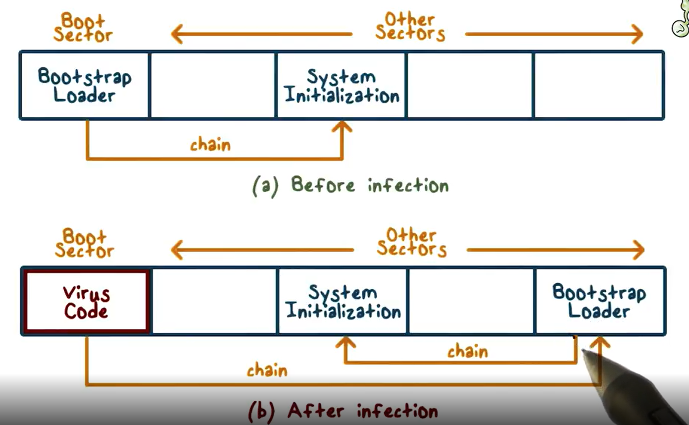

# What is Cybersecurity ?

Cybersecurity is the practice of ensuring confidentiality, integrity and availability of information of networks, devices, people and unauthorized access of data.

# What is athreat actor ?

Any person or group that might represent a security risk

# What a security analyst do ?

Security analyst are responsible for monitoring and protectiong information and systems.

- They protect computers and networks.
- They can do "exercises" penetrating and ethical hacking their on enterprise network for finding vulnerabilities.
- They install prevention software.
- They can work with software development together with development teams ensuring the security standards of the enterprise are meet.
- They conduct periodic security audits (review of all security activies).

# What is phishing ?

Phishing is a type of cyber-attack that consists of stealing sensitive information like passwords from a user through sites, e-mails, contact and others that seems to be reliable.

# The two parts of a day-to-day security employee

- Operations: Responding to detections and doing investigation
- Projets: Building new detections and enhancing current ones.

# What is a playbook in cybersecutiry ?

Is a list of how to go through cetain detections, and what it needs to be look through on those incidents.

# What is Security frameworks, controls and posture ?

- Security frameworks are guidelines for building plans to mitigate risk.
- Security controls are safeguards designed to reduce risk.
- Security posture is an organization's ability to secure assets and data and respond to threats.

# What is a SIEM tool ?

They are security of information and event management tools used to automate threat detections and others unusual things that may represent a security risk.

# What is Intrusion detection systems (IDSs) ?

They are software used to detect possible unathourized access to a network or intrusion.

# What is computer forensis ?

Is the area that studies the ways of investiganting, finding and preserving evidences in networks and electronic devices.

# What is Personally Indentifiable Information (PII) ?

Is any information that can be used to identify a person's identity.

# What is Sensitive Personally identifiable Information (SPII) ?

Is any type of PII that falls under some specific stricter guideline, that can represent a greater threat to the source of the information.

# What is a computer virus ?

A computer Virus is a program written to interfere with computer operations and cause problems to data and software. They can attach themselves to programs or documents on a computer and spread themselves to other computers.
They are usually called Malware

# What is Malware ?

Software designed to cause harm to a computer or network.

# What is the story of the Brain Virus ?

The Brain Virus was the first virus created for IBM computers at January 19, 1986 by Pakistanese. He was virus created with the objective to keep the software of the creators safe, like a way of preventing piracy.
The virus would infect the boot sector of floppy disks (disquete) replacing the original with their own. He consumed resources, making the system slow and because of the replacement of the sector boot it could result in data loss.
One interesting aspect of it was that he would infect other flopp disks making him spread really quickly, as well being hard to detect due to its place of execution (boot sector).
The virus would display a message in the boot sector with the name of the creators who intended to find piracy copies buyers.
This virus open the eyes of the public to the harm of virus and the need for anti-viruses

# What was the Moris Worm Virus ?

The Morris Worm (November of 1988) was one of the first computer worms distributed to the internet. The worm exploited several vulnerabilities in Unix systems and due to code mistakes the worm would copy itself more agressively causing DoS (Denial-of-Service) by using too much of the computer resources.
This virus would highlight vulnerabilities on the early internet days.
The author was convicted.

# What is a Trojan Horse (Trojan) ?

Trojan is a malware that mislead users of its true intent by disguising himself usually using social engineering like an email.

# What is a Ransomware ?

A Ransomware is a malware that encrypts a victim's personal data and ask for a ransom, usually paid in some hard to track currency like criptocurrency, so that the person can have its data back. They are usually spread through Trojan Horses.

# What was the ILOVEYOU or Loveletter computer worm ?

The Loveletter was a computer worm from 2000, by Onel de Guzman, Philipine, that hided itself inside a file in an email entitled "ILOVEYOU", the file would execute a program that would overwrote random files, copy itself to all email address in the Windows Address Book spreding itself, and download a trojan horse that would steal login information from the Internet Explorer browser.

# What is the difference between a virus and a computer worm ?

The virus needs to be attached to a program of file to be executed and spread itself through human intervention. A computer worm is a standalone program that could spread itself without the need of human intervention.

# What is social engineering ?

Is a technique that exploits human errors to gain access to private information.

# What was the Equafax data breach of 2017 ?

Was a breach in an american enterprise that stoled a lot of information (SPII) data from users of the enterprise. The intruders exploited a vulnerability due to a update in a software and gain access as an authorized user.

# What are the computer security incident response teams (CSIRTs) ?

Teams of security that have the mission to respond rapiddly to incidents involving cybersecurity

# What are Spyware ?

Spyware is malware that gathers and sell information about a user without consent.

# What is spear phishing ?

Is a phishing technique that targets specific users or groups misleading them to believe that the source is secure.

# What is Whaling ?

A phishing technique that targets executives.

# What is Business email compromise (BEC) ?

A phishing attack with impersonation of a person to gain financial vantage

# What is Vishing ?

A phising attack impersonation of electronic voice communication.

# What is Social media phishing ?

Is an attack where the threat actor studies a persons social media before attacking.

# What is Watering hole attack ?

Is an Social engineering attack that consists of exploiting a site frequently visited by specific users.
